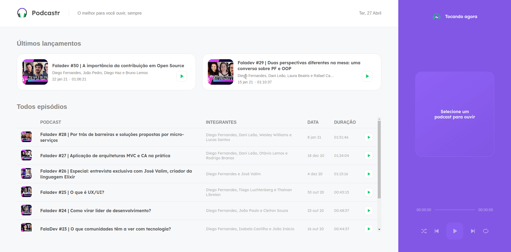

<h2 align="center">
    
</h2>
  
<p align="center">
  

  

  	
  <a href="https://www.linkedin.com/in/gabriel-pereira-oliveira-78b1801ab/">
    
  </a>
	
  
  <a href="https://github.com/Gabrielpdev/podCaster/commits/master">
    
  </a>

  
   <a href="https://github.com/Gabrielpdev/podCaster/stargazers">
    
  </a>
</p>

<h2 align="center">
    
</h2>

<p align="center">
  <a href="https://github.com/Gabrielpdev/podCaster/README.md">English</a>&nbsp;&nbsp;&nbsp;|&nbsp;&nbsp;&nbsp;
  <a href="https://github.com/Gabrielpdev/podCaster/README-PT.md">Portuguese</a>
</p>

## 📝 Conteúdo
<p align="center">
<a href="#about">Sobre</a>&nbsp;&nbsp;&nbsp;|&nbsp;&nbsp;&nbsp;
<a href="#getting_started">Iniciando</a>&nbsp;&nbsp;&nbsp;|&nbsp;&nbsp;&nbsp;
<a href="#built_using">Tecnologias Utilizadas</a>&nbsp;&nbsp;&nbsp;|&nbsp;&nbsp;&nbsp;
<a href="#roadmap">Metas de desenvolvimento</a>&nbsp;&nbsp;&nbsp;|&nbsp;&nbsp;&nbsp;
<a href="#contribute">Como contribuir</a>&nbsp;&nbsp;&nbsp;|&nbsp;&nbsp;&nbsp;
</p>


## 🧐 Sobre <a name = "about"></a>

podCaster é uma Aplicação feita durante a **NWL 5.0** oferecido pela [Rocketseat] :rocket:.<br/> 
A aplicação é um tocador de podcast, responsivo para qualquer dispositivo, feita usando as Tecnologias de Páginas estáticas <br/> 
com o NextJs e com uso de hook customizados para o players dos podcasts.<br/> 

<span align="center">
	<h2>Demo</h2>
	
	
</span>

## 🏁 Iniciando <a name = "getting_started"></a>

Instruções de como acessar as rotas e instalação.

### ⚒ Instalando <a name = "installing"></a>
```
git clone https://github.com/Gabrielpdev/podCaster.git

$ yarn
$ yarn start
```

## ⛏️ Tecnologias Utilizadas <a name = "built_using"></a>

As seguintes ferramentas foram usadas na construção do projeto:
- 🔵 [TypeScript][typescript]
- ⚛️ [React][reactjs]
- 💅 [Styled-components][styled-components]
- 🔼 [NextJs][next]

## 👨‍💼 Metas de desenvolvimento <a name = "roadmap"></a>

- Desenvolver o sistema de Podcast.
- Usuário pode pausar e continuar de onde parou.
- Usuário pode avançar ou voltar o podcast.
- Usuário pode colocar audio em ordem aleatória.
- Usuário pode colocar audio para repetir.
- Usuário pode acessar que qualquer dispositivo (celular, pc, tablet....).

## 🤔 Como contribuir <a name = "contribute"></a>

- Faça um fork desse repositório;
- Cria uma branch com a sua feature: `git checkout -b minha-feature`;
- Faça commit das suas alterações: `git commit -m 'feat: Minha nova feature'`;
- Faça push para a sua branch: `git push origin minha-feature`.

Feito com ❤️ por Gabriel Pereira 👋🏽 [Entre em contato!](https://www.linkedin.com/in/gabriel-pereira-oliveira-78b1801ab/)

[typescript]: https://www.typescriptlang.org/
[reactjs]: https://reactjs.org
[rs]: https://rocketseat.com.br
[Rocketseat]:https://github.com/Rocketseat
[styled-components]:https://styled-components.com/
[next]: https://nextjs.org/


