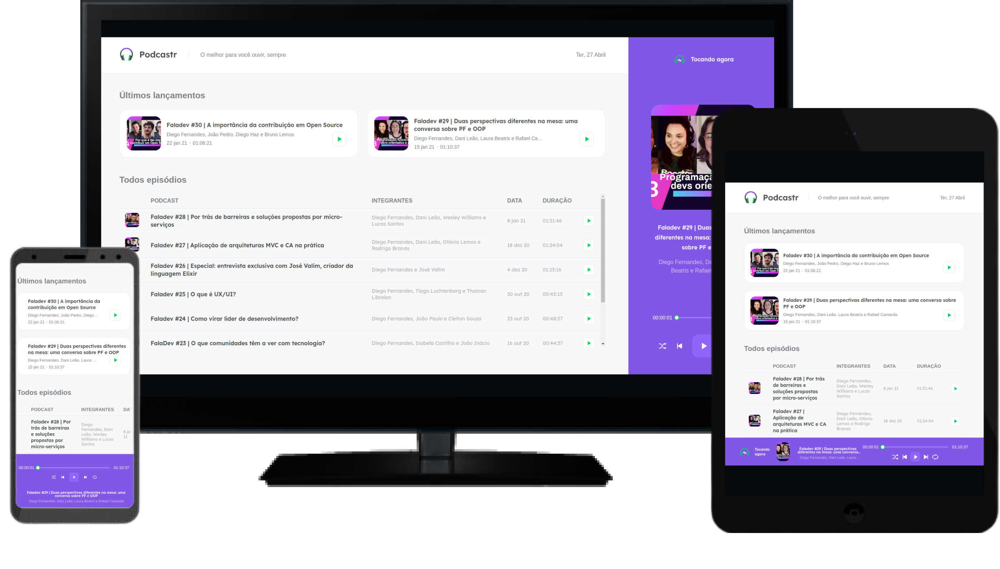
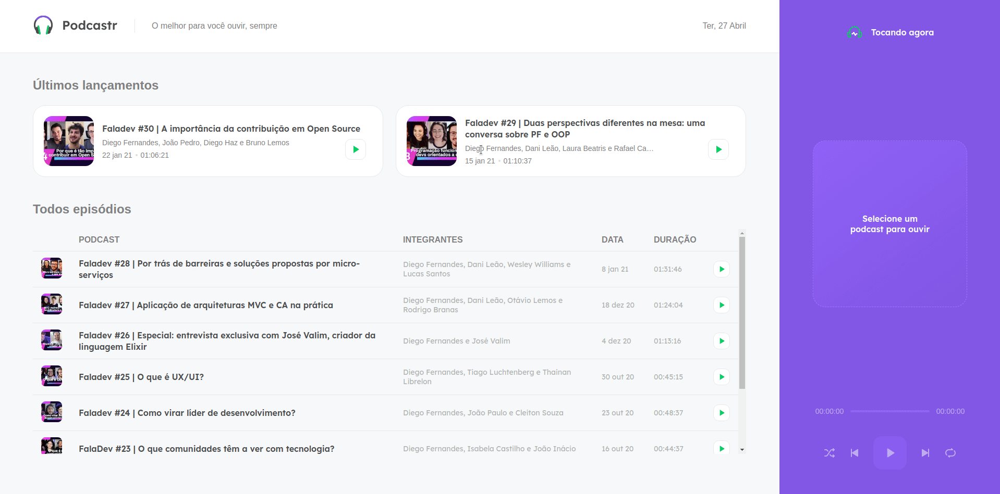
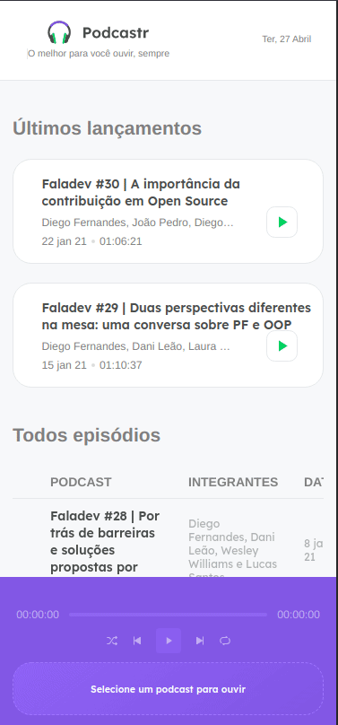

<h2 align="center">
    
</h2>
  
<p align="center">
  

  

  	
  <a href="https://www.linkedin.com/in/gabriel-pereira-oliveira-78b1801ab/">
    
  </a>
	
  
  <a href="https://github.com/Gabrielpdev/podCaster/commits/master">
    
  </a>

  
   <a href="https://github.com/Gabrielpdev/podCaster/stargazers">
    
  </a>
</p>

<h2 align="center">
    
</h2>

<p align="center">
  <a href="https://github.com/Gabrielpdev/podCaster/blob/main/README.md">English</a>&nbsp;&nbsp;&nbsp;|&nbsp;&nbsp;&nbsp;
  <a href="https://github.com/Gabrielpdev/podCaster/blob/main/README-PT.md">Portuguese</a>
</p>

## 📝 Content
<p align="center">
<a href="#about">About</a>&nbsp;&nbsp;&nbsp;|&nbsp;&nbsp;&nbsp;
<a href="#getting_started">Initializing</a>&nbsp;&nbsp;&nbsp;|&nbsp;&nbsp;&nbsp;
<a href="#built_using">Technologies Used</a>&nbsp;&nbsp;&nbsp;|&nbsp;&nbsp;&nbsp;
<a href="#roadmap">Development goals</a>&nbsp;&nbsp;&nbsp;|&nbsp;&nbsp;&nbsp;
<a href="#contribute">How contribute</a>&nbsp;&nbsp;&nbsp;|&nbsp;&nbsp;&nbsp;
</p>


## 🧐 Sobre <a name = "about"></a>

podCaster is an application maked during the **NWL 5.0** offer by [Rocketseat] :rocket:.<br/>
This application is a player podcast, responsive to any device, maked using technology like NextJs and custom hooks. </br>

<span align="center">
	<h2>Demo</h2>
	
	
</span>


## 🏁 Initializing <a name = "getting_started"></a>

Instructions on how to access and install.
### ⚒ Installing <a name = "installing"></a>
```
git clone https://github.com/Gabrielpdev/podCaster.git

$ yarn
$ yarn start
```

## ⛏️ Technologies Used <a name = "built_using"></a>

The following tools were used in the construction of the project:
- 🔵 [TypeScript][typescript]
- ⚛️ [React][reactjs]
- 💅 [Styled-components][styled-components]
- 🔼 [NextJs][next]
## 👨‍💼 Development goals <a name = "roadmap"></a>
- Develop the Podcast system.
- User can pause and resume where he left off.
- User can fast forward and rewind the podcast.
- User can place audio in random order. 
- User can put audio to repeat.
- User can access from any device (cell phone, pc, tablet ....).

## 🤔 How contribute <a name = "contribute"></a>
- Fork this repository;
- Create a branch with your feature: `git checkout -b my-feature`;
- Commit your changes: `git commit -m 'feat: Minha nova feature'`;
- Push to your branch: `git push origin minha-feature`.

Made with ❤️ by Gabriel Pereira 👋🏽 [Contact!](https://www.linkedin.com/in/gabriel-pereira-oliveira-78b1801ab/)

[typescript]: https://www.typescriptlang.org/
[reactjs]: https://reactjs.org
[rs]: https://rocketseat.com.br
[Rocketseat]:https://github.com/Rocketseat
[styled-components]:https://styled-components.com/
[next]: https://nextjs.org/


